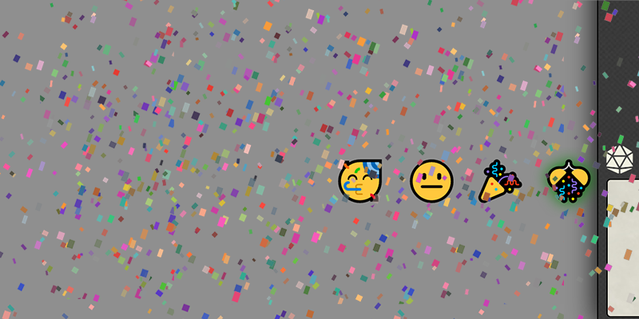

# Confetti


[](https://ko-fi.com/elffriend)


Everyone loves Confetti.

## Installation

Module JSON:

```
https://github.com/ElfFriend-DnD/foundryvtt-confetti/releases/latest/download/module.json
```

## Screenshots



## Configuration

| **Name**            | Description                                                                                                                                       |
| ------------------- | ------------------------------------------------------------------------------------------------------------------------------------------------- |
| GM Only             | If you're a GM who absolutely hates letting your players have nice things, you'll enable this and remove the confetti buttons from their screens. |
| Confetti Multiplier | How much confetti is too much? We let you decide, personally I think the answer is 'as much as you can handle'.                                   |
| Mute                | If _you_ think those sounds are annoying, imagine being the guy writing this thing.                                                               |

## Compatibility

Its confetti! What do you mean it got everywhere and is messing something up? What did you expect to happen?

## API

After the hook `confettiReady` is fired, the following api methods are expected to be on `window.confetti`:

### `confettiStrength`
a typescript enum:
```ts
enum ConfettiStrength {
  'low' = 0,
  'med' = 1,
  'high' = 2,
}
```

### `getShootConfettiProps(strength: ConfettiStrength)`

Returns the properties that `handleShootConfetti` and `shootConfetti` use based on the strength you feed it.

### `handleShootConfetti(shootConfettiProps: ShootConfettiProps)`

Makes the appropriate amount of confetti fire on only the current user's screen.

### `shootConfetti(shootConfettiProps: ShootConfettiProps)`

Makes the appropriate amount of confetti fire on all clients' screens.

### Example:

```ts
function makeConfetti() {
  const strength = window.confetti.confettiStrength.low;
  const shootConfettiProps = window.confetti.getShootConfettiProps(strength);

  if (isSecretCelebration) {
    // I only want this to happen on my user's screen
    window.confetti.handleShootConfetti(shootConfettiProps);
  } else {
    // I want confetti on all connected users' screens
    window.confetti.shootConfetti(shootConfettiProps);
  }
}
```


## Known Issues

- Yes, if you spam the shit out of the confetti buttons it will get everywhere and probably crash a computer. It _is_ confetti after all.
- Yes, if you set the Confetti Multiplier to 10, you _will_ have a bad time. Or maybe a great time, depends how much you're willing to trade for your confetti.

## Acknowledgements
Sound Effects from [Zapsplat.com](https://www.zapsplat.com/).

This was created in a caffiene induced frenzy during the D20 Day 2020 hackathon put on by the [League of Extraordinary FoundryVTT Developers](https://forums.forge-vtt.com/c/package-development/11).

Bootstrapped with Nick East's [create-foundry-project](https://gitlab.com/foundry-projects/foundry-pc/create-foundry-project).
